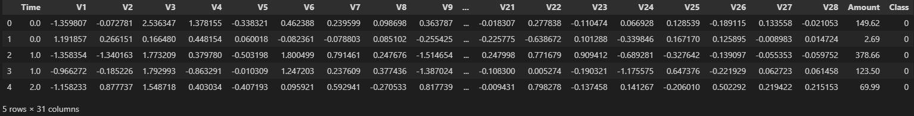
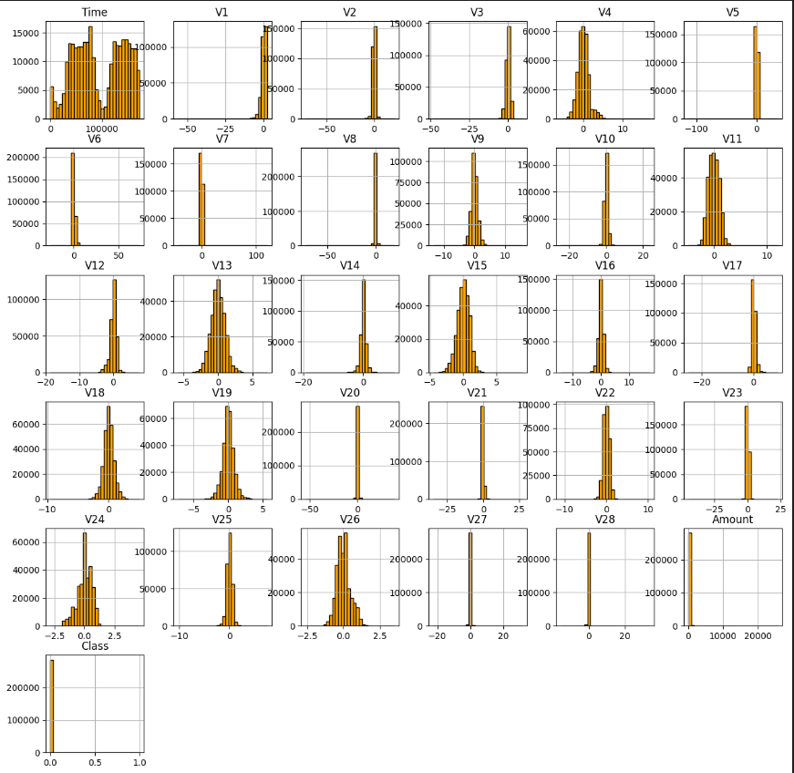

# Big Data - Project 2

<div style='page-break-after: always'></div>
<a href="https://colab.research.google.com/github/BolachinhaAmericana/BigDataProject/blob/main/colab-code.ipynb" target="_parent"></a>

---


ESTBarreiro - IPS\
Bioinformatics, Janurry 2023\
3rd year, 1st semester\
Made by:
- Duarte Valente 202000053
- Guilherme Sá 202000201 \
Teachers:
- Raquel Barreira
- António Gonçalves

# Introduction
This project has the main purpose getting us to know and use Spark on a Machine Learning context. \
Here we are going to use machine learning algorithms to analyze a big amount of data, predict results to a problem as well as use Spark to read and present the results regarding the ML models.\
All of this has the intent of creating a big data and high performance environment.
## Dataset Introduction
The choosen dataset can be found [here](https://www.kaggle.com/code/ukveteran/sparkml-credit-card-fraud-jma/data).\
This data contains information about credit card transactions where we will focus on trying to predict weather a transaction is fraud or not based on what transactions characteristics we have.\
- Dataset Name: SparkML - Credit Card Fraud - KMA
- Dataset file name: creditcard.csv
# Code
## Installing necessary packages
```python
%pip install pyspark

# Spark Session imports
from pyspark import SparkContext, SparkConf
from pyspark.sql import SparkSession
# Spark ML imports
from pyspark.ml.feature import VectorAssembler
from pyspark.ml.classification import LogisticRegression
from pyspark.ml.evaluation import BinaryClassificationEvaluator
from pyspark.ml.classification import RandomForestClassifier
# other imports 
import matplotlib as plt
```

## Creating a Spark environment
Here we are going to create a pyspark environment called: "CreditcardPrediction" using the local machine as master.\
\
When we are working with Spark, we need to create a session SparkSession to manage all configurations on our spark environment.
```python
conf= SparkConf().setAppName('CreditCardPrediction').setMaster('local[*]')
sc= SparkContext.getOrCreate(conf=conf)
spark = SparkSession(sc)
```
## Visualizing Data
Taking a look at a sample from the data:
```python
df.toPandas().head()
```

## Dataset Columns description
The data is composed of 31 columns and 28 of them are ``` Vx```. These go from ```V1``` all the way to ```V28``` and represent encrypted characteristics to protect users information.
- ```Time``` -> Number of seconds between current and first transactions.
- ```V(1-28)``` -> encrypted user information.
- ```Amount``` -> Amount of money transferred
- ```Class``` -> Classifier if transaction is fraud. Will be 0 if fraud and 0 otherwise
### Data Distribution
```python
# code
counts = df.groupBy("Class").count()
counts.show()

#output
+-------+--------+
| Class | count  |
+=======+========+
|    1  |   492  |
|    0  | 284315 |
+-------+--------+
# code
print(f"Numero de Linhas: {df.count()}")
print(f"Numero de Colunas:{len(df.columns)}")
print("Esquema do DataFrame:")
df.printSchema()
# output
Numero de Linhas: 284807
Numero de Colunas:31
Esquema do DataFrame:
root
 |-- Time: double (nullable = true)
 |-- V1: double (nullable = true)
 |-- V2: double (nullable = true)
 |-- V3: double (nullable = true)
 |-- V4: double (nullable = true)
 |-- V5: double (nullable = true)
 |-- V6: double (nullable = true)
 |-- V7: double (nullable = true)
 |-- V8: double (nullable = true)
 |-- V9: double (nullable = true)
 |-- V10: double (nullable = true)
 |-- V11: double (nullable = true)
 |-- V12: double (nullable = true)
 |-- V13: double (nullable = true)
 |-- V14: double (nullable = true)
 |-- V15: double (nullable = true)
 |-- V16: double (nullable = true)
 |-- V17: double (nullable = true)
 |-- V18: double (nullable = true)
 |-- V19: double (nullable = true)
 |-- V20: double (nullable = true)
 |-- V21: double (nullable = true)
 |-- V22: double (nullable = true)
 |-- V23: double (nullable = true)
 |-- V24: double (nullable = true)
 |-- V25: double (nullable = true)
 |-- V26: double (nullable = true)
 |-- V27: double (nullable = true)
 |-- V28: double (nullable = true)
 |-- Amount: double (nullable = true)
 |-- Class: integer (nullable = true)
```
## Summarizing Data
The data has a dimension of 284804 entities and 31 characteristics.\
It also has a tiny amount of **fraud** cases (492), around **0.2%** of the **sample size**.\
Given that this is comes off as a **yes** or **no** question we are expecting some problems on training our prediction models given this disparity in value samples.
## Graphs
Code to graphs to all characteristics and their distribution
```python
num_cols = [i for i in df.columns]
df_num = df.select(num_cols)
df_num.toPandas().hist(figsize=[15,15],bins=30, color='orange', histtype='bar', ec='black')
```
\
\

### Brief analysis of the histograms
These histograms are presented with the intent of showing the distribution of the count on the values of their range.\
- ```Time``` -> There is not much to take off this histogram other then the fact that there was no relevant time gap where there where no transactions. We can observe, however that there are peak times for sure.
- ```V(1-28)``` -> We can't take any valuable insights from this characteristics since we don't know what are they referring to.
- ```Amount``` -> We can observe that most of the transfer amount goes a tiny bit to the right of 0 and that almost all transactions are of values under 1000.
- ```Class``` -> On this histogram we can visually confirm that the disparity in the amount of non-fraud transactions is absolutely dominating and that we can't even see the fraud transactions bar.
## Preparing data to apply machine learning
We are start by verifying the existence of empty values:
```python
# code
null_values = []
for col in df.columns:
    null_values.append((col, df.filter(df[col].isNull()).count()))
col_count = 0
null_col_count = 0
for col, value in null_values:
    col_count = col_count + 1
    if value == 0:
        null_col_count = null_col_count + 1
    else:
        print(f"{col} : {value} missing values")
if col_count == null_col_count:
    print("Nao ha valores nulos")
# output on this dataset
Nao ha valores nulos
```
After verifying that we don't have any null values, we are going to transform the entries into vectors.
> To do this we are going to gather all characteristics from the data and exclude the target variable to create the vector object with all information but the one we cut off. After this our result should be something like:\
```[feature 1 | col1 | col2 | col... | Class]``` to:\
```[col1 | Class]```
```python
#code
cols = df.columns
cols.remove('Class')
# first we add al columns to a var and remove last col
assembler = VectorAssembler(inputCols= cols, outputCol= 'features')
# second we "glue" all the features together inside this variable.
df = assembler.transform(df)
```
after this we visualize the data after the changed and we should be able to observe that instead of 31 columns we now have only 2 and we will be using the "features" column to predict the "Class" since "features" is nothing more nothing less then all the other 30 features mashed together.
```python
#code
df = df.select(['features', 'Class'])
df.show(5)
#output
+--------------------+-----+
|            features|Class|
+--------------------+-----+
|[0.0,-1.359807133...|    0|
|[0.0,1.1918571113...|    0|
|[1.0,-1.358354061...|    0|
|[1.0,-0.966271711...|    0|
|[2.0,-1.158233093...|    0|
+--------------------+-----+
only showing top 5 rows
```
## Applying Machine Learning Models
In this project we will be using 2 ML algorithms, *Linear Regression* and *Random Forest*.\
The choice of these models was made based on the fact that these algorithms are great to binary classification therefor are adequate for our dataset.
### Defining Test/Split variables.
In this case we are going to split the data as of 70% to training and 30% to test. We are also going to leave the seed parameter empty in order for the data cut to be made randomly every time.
```python
training, testing= df.randomSplit([0.7, 0.3])
```
### Model -> Logistic Regression
#### Training and fitting the model
```python
lr = LogisticRegression(labelCol='Class', featuresCol='features')
model= lr.fit(training) # fit training data
predictions = model.transform(testing) # testing the model with test data
```
#### Verifying test result
```python
#code
evaluator = BinaryClassificationEvaluator(labelCol='Class', rawPredictionCol='rawPrediction')
accuracy = evaluator.evaluate(predictions)
#output of a random run
0.960957953931887
```
> With this we can observe that with logistic regression we got an accuracy of approximately 96.1%
### Model -> Random Forest
#### Training and fitting the model
We decided to make the tree max depth of 5 to avoid overfitting.
```python
rf = RandomForestClassifier(labelCol="Class", featuresCol="features", maxDepth= 5)
model = rf.fit(training)
predictions = model.transform(testing)
```
#### Verifying test result
```python
#code
evaluator = BinaryClassificationEvaluator(labelCol='Class', rawPredictionCol='rawPrediction')
accuracy = evaluator.evaluate(predictions)
accuracy
#output of a random run
0.9621722395163965
```
> With this we can observe that with Random Forest we got an accuracy of approximately 96.2%
# Conclusion
In this work we used PySpark to load, process and analyze a Dataset while simulating a BigData and High-Performance environment.\
Following this we used MLlib to train and evaluate multiple machine leaning models such as Logistic regression and Random Forest.\
Both of these models got a performance that we though was adequate on the matter that they had good accuracy values despite the huge discrepancy on the classes sample size variety matter.

**Should be noted**\
Logistic Regression we got a lower value then on Random Forest algorithm. This was due to to random chance on part of the test-split division and most of the times we ran the program we verified that the Logistic Regression usually displays the best results.